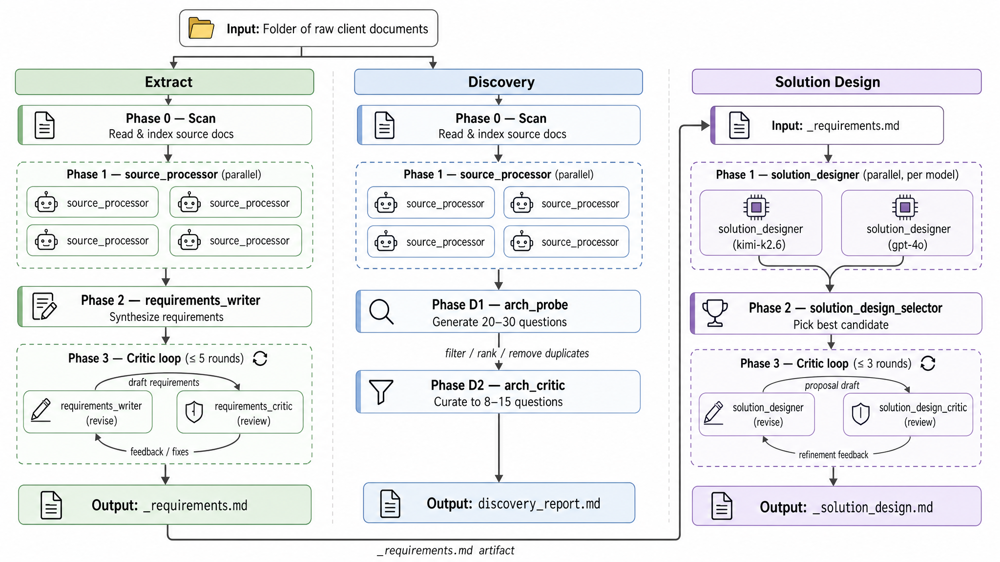
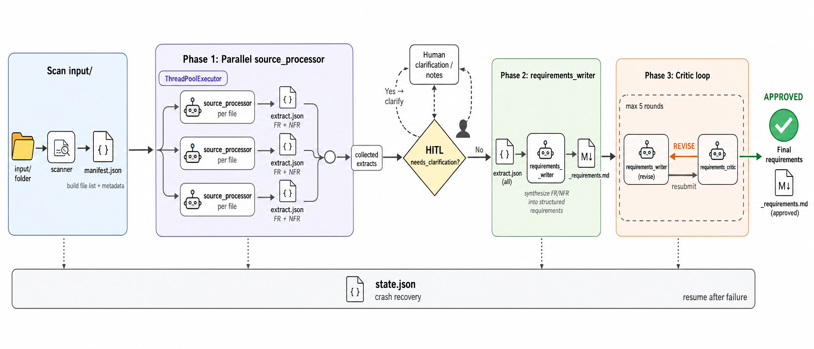
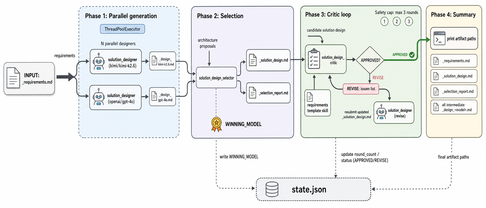

# spectra

**spectra** takes a folder of raw client documents — RFPs, proposals, meeting notes, PDFs, spreadsheets, images — and produces polished technical deliverables: a structured requirements spec, a curated set of architect discovery questions, and a full solution design proposal. Drop files in, the pipeline runs, documents come out.

Internally it is a multi-agent AI system. **opencode** CLI agents do the reading and writing — any model from any provider works: Kimi K2.6, DeepSeek, GPT-4o, Claude, Qwen, or a local model via Ollama. Python runners handle orchestration — phase ordering, parallelism, crash recovery, and retry logic. Every hand-off between phases is a file on disk, so any step can be resumed after a failure without re-running completed work.

Three pipelines, same input folder:

| Pipeline | Runner | Input | Output | When to use |
|---|---|---|---|---|
| **Extract** | `requirements_runner.py` | Raw documents | `_requirements.md` | Structured FR/NFR/BR spec from unstructured sources |
| **Discovery** | `requirements_runner.py --mode discovery` | Raw documents | `discovery_report.md` | Curated architect questions before a workshop |
| **Solution Design** | `solution_design_runner.py` | `_requirements.md` | `_solution_design.md` | Full technical solution proposal from a spec |

---

## Pipelines



*Fig. 1. Three pipelines — Extract, Discovery, and Solution Design — all orchestrated by Python runners. Extract and Discovery share Phase 0 and Phase 1 (parallel source extraction). Solution Design takes a finished requirements doc as input.*

Two modes, same input:

| Mode | Flag | Output | When to use |
|---|---|---|---|
| `extract` | `--mode extract` (default) | `_requirements.md` — FR / NFR / BR / conflicts / gaps | Structured spec from raw source docs |
| `discovery` | `--mode discovery` | `discovery_report.md` — curated architect questions | Before a workshop; when you need to find what's missing |

---

## Quick Start

```bash
# Clone and set up
git clone <repo>
cd spectra
python3 -m venv .venv && .venv/bin/pip install loguru pyyaml

# Configure
cp .env.example .env
# → add MOONSHOT_API_KEY and OPENAI_API_KEY to .env

# Run requirements extraction
.venv/bin/python3 requirements_runner.py run /path/to/input/folder

# Run discovery mode
.venv/bin/python3 requirements_runner.py run /path/to/input/folder --mode discovery

# Run solution design (after extraction)
.venv/bin/python3 solution_design_runner.py run \
  /path/to/requirements_YYYYMMDD_HHMMSS/_requirements.md

# Run solution design with multiple models (parallel)
.venv/bin/python3 solution_design_runner.py run \
  /path/to/requirements_YYYYMMDD_HHMMSS/_requirements.md \
  --models kimi/kimi-k2.6 openai/gpt-4o

# Check run status
.venv/bin/python3 requirements_runner.py status \
  /path/to/requirements_YYYYMMDD_HHMMSS

# Resume an interrupted run
.venv/bin/python3 requirements_runner.py resume \
  /path/to/requirements_YYYYMMDD_HHMMSS

# Resume and retry all failed steps
.venv/bin/python3 requirements_runner.py resume \
  /path/to/requirements_YYYYMMDD_HHMMSS --retry-failed

# Force-rerun a specific step
.venv/bin/python3 requirements_runner.py resume \
  /path/to/requirements_YYYYMMDD_HHMMSS --force-step critic:r2
```

---

## Setup

### Prerequisites

- Python 3.11+
- [opencode](https://opencode.ai) CLI — `brew install anomalyco/tap/opencode`
- `MOONSHOT_API_KEY` — from [platform.moonshot.ai](https://platform.moonshot.ai)
- `OPENAI_API_KEY` — from [platform.openai.com](https://platform.openai.com) (optional, for multi-model designs)

### Environment

```bash
cp .env.example .env
```

Edit `.env`:

```
MOONSHOT_API_KEY=sk-...        # Kimi K2.6 — main model for all agents
OPENAI_API_KEY=sk-...          # GPT-4o — optional, for parallel solution design
CONFLUENCE_TOKEN=...            # Confluence MCP (optional)
JIRA_TOKEN=...                  # Jira MCP (optional)
```

### MCP Servers (optional but recommended)

| Server | Purpose | Required for |
|---|---|---|
| `pdf-reader` | Read PDF documents natively | Source PDFs |
| `tavily-remote` | Web search during research | arch_probe, solution_designer |
| `mcp-atlassian` | Fetch Confluence pages by URL | Confluence source docs |

Configured in `opencode.json` — edit paths if your system differs.

---

## Input

Drop any combination of files into a folder and pass it to `requirements_runner.py run`:

| File type | How it's read |
|---|---|
| `.pdf` | `pdf-reader` MCP tool |
| `.docx` / `.pptx` / `.xlsx` | `read` tool (pre-converted) |
| `.md` / `.txt` | `read` tool |
| `.png` / `.jpg` / `.jpeg` / `.webp` | Vision (multimodal) |
| Subfolders | Treated as one logical source (one agent per folder) |
| `.txt` with URL | Confluence via MCP or direct `webfetch` |

Excluded automatically: `plan/`, `.git/`, `.github/`, `__pycache__/`, `outputs/`.

---

## Output Structure

Every run creates a self-contained timestamped folder sibling to the input:

```
project/
  input/                                  ← your source documents (untouched)
  requirements_20260604_152709/           ← run output
    _requirements.md                      ← the deliverable
    plan/
      params.yaml                         ← model overrides, trust policy
    state.json                            ← crash-safe ledger
    _artifacts_20260604_152709/
      runner.log
      intake/
        manifest.json                     ← scanned entries with extract status
      extracts/
        <slug>/
          extract.json                    ← structured output per source
          raw.txt                         ← raw agent response
          agent.events.jsonl              ← opencode event stream log
        _requirements_writer/
          agent.events.jsonl
        _requirements_critic_r1/
          verdict.md                      ← VERDICT: APPROVED / REVISE
          agent.events.jsonl
      prompts/
        <slug>.md                         ← task prompt sent to each agent
        _requirements_writer.md
        _requirements_critic_r1.md
```

Solution design output:

```
project/
  requirements_20260604_152709/
    _requirements.md                      ← input (untouched)
  solution_design_20260604_160312/
    _solution_design.md                   ← final deliverable
    _design_kimi_kimi-k2_6.md             ← Phase 1 candidate
    _design_openai_gpt-4o.md              ← Phase 1 candidate (if --models)
    _selection_report.md                  ← WINNING_MODEL: ...
    _verdict_round1.md                    ← critic verdict
    state.json
    prompts/
    logs/
```

---

## Pipeline Details

### Extract Mode



*Fig. 2. Extract pipeline — scan, parallel extraction, synthesis, critic loop.*

```
Phase 0 → Phase 1 (parallel) → Phase 2 → Phase 3 (loop)
  scan      source_processor    writer     critic ↔ writer
```

#### Phase 0 — Scan + Manifest

`requirements_runner.py` walks the input folder, classifies every item by type, and builds `manifest.json`. Each entry gets a slug, kind (`file` / `subfolder`), and the appropriate `read_tool`.

#### Phase 1 — Parallel Source Extraction

One `source_processor` agent per manifest entry, all launched concurrently via `ThreadPoolExecutor`. Each agent:

- identifies the document type (transcript / chat / brief / PDF / spreadsheet / QA)
- loads the matching extraction strategy from `prompts/source_processor/strategies/`
- outputs `extract.json` with: `requirements`, `decisions`, `constraints`, `open_questions`, `trust_level`

Heartbeat printed every 10 s:
```
[09:01:10] [rfp-doc] start
[09:01:20] [rfp-doc] running... 10s elapsed, timeout in 3590s
[09:02:03] [rfp-doc] done
```

**HITL:clarify** (if `--interactive`): any agent returning `needs_clarification: true` pauses the runner for a terminal answer. The agent is re-run with the clarification appended. Up to 2 clarification rounds.

#### Phase 2 — Requirements Writer

`requirements_writer` reads all successful `extract.json` files and synthesises `_requirements.md`:

- Functional requirements (FR-001, FR-002, …)
- Non-functional requirements (NFR-001, …)
- Business requirements (BR-001, …)
- Conflict register — contradictions between sources
- Gap register — unanswered questions
- Assumptions

Validated before advancing: must contain `# Requirements:` title and at least one `FR-` entry.

#### Phase 3 — Critic ↔ Writer Loop

`requirements_critic` reviews `_requirements.md` against source extracts and writes a verdict:

```
VERDICT: APPROVED
```
or
```
VERDICT: REVISE
- Section 2.1: missing NFR for response time
- Conflict FR-004 vs FR-017 unresolved
```

If `REVISE` — verdict is injected into the writer's next prompt and `requirements_writer` revises. Repeats until **`APPROVED`** or the safety cap of **5 rounds** (`MAX_CRITIC_ROUNDS`). Hitting the cap is a warning, not a failure.

---

### Discovery Mode

```
Phase 0 → Phase 1 (parallel) → Phase D1 → Phase D2
  scan      source_processor    probe      critic
```

Phases 0 and 1 are identical to Extract mode.

**Phase D1 — arch_probe**: reads all `extract.json` files, runs Tavily web searches for domain context, generates **20–30 raw discovery questions** tied to specific gaps.

**Phase D2 — arch_critic**: curates the raw questions down to **8–15 questions** that block architecture decisions if unanswered. Writes `discovery_report.md` directly.

---

### Solution Design Pipeline



*Fig. 3. Solution Design pipeline — parallel multi-model generation, selection, critic loop.*

```
Phase 1 (parallel) → Phase 2 → Phase 3 (loop) → Phase 4
  N × solution_designer   selector   critic ↔ designer   summary
```

#### Phase 1 — Parallel Generation

One `solution_designer` agent per model, all launched concurrently. Each produces `_design_<model_slug>.md` — a complete solution design in one committed architecture. No options menus, no effort estimates.

Default: `kimi/kimi-k2.6`. Override:

```bash
# Two designs in parallel
python3 solution_design_runner.py run _requirements.md \
  --models kimi/kimi-k2.6 openai/gpt-4o

# Three designs in parallel
python3 solution_design_runner.py run _requirements.md \
  --models kimi/kimi-k2.6 openai/gpt-4o openai/gpt-4.1
```

If one model fails, the pipeline continues with the survivors.

#### Phase 2 — Selection

Single candidate → copied as `_solution_design.md`.

Multiple candidates → `solution_design_selector` reads all and picks the strongest. Writes `_selection_report.md` with `WINNING_MODEL: <model>` on the first line. If selector fails: first successful candidate used as fallback.

#### Phase 3 — Critic Loop

`solution_design_critic` reviews `_solution_design.md` against the requirements template (`.github/skills/solution-design-template/SKILL.md`) and writes a verdict. If `REVISE` — the winning model's designer runs a revision. Safety cap: **3 rounds**.

#### Phase 4 — Summary

Prints paths to all artifacts, winning model, final verdict, and count of `<!-- ILLUSTRATION: -->` placeholders for the Illustrator agent.

---

## CLI Reference

### `requirements_runner.py`

| Subcommand | Argument | Default | Description |
|---|---|---|---|
| `run` | `project_dir` | — | Path to folder with source documents |
| `run` | `--mode` | `extract` | `extract` or `discovery` |
| `run` | `--interactive` | off | Pause at HITL checkpoints |
| `run` | `--debug` | off | DEBUG-level logging to stderr |
| `status` | `output_dir` | — | Step table: status, elapsed, tries, artifact/error |
| `resume` | `output_dir` | — | Continue from where execution stopped |
| `resume` | `--retry-failed` | off | Reset all `failed` steps to `pending` |
| `resume` | `--force-step STEP_ID` | — | Force-reset one step (e.g. `critic:r2`) |

### `solution_design_runner.py`

| Subcommand | Argument | Default | Description |
|---|---|---|---|
| `run` | `requirements_path` | — | Path to `_requirements.md` |
| `run` | `--models MODEL [...]` | `kimi/kimi-k2.6` | Models for parallel Phase 1 |
| `run` | `--verbose` / `-v` | off | DEBUG logging to stderr |
| `status` | `output_dir` | — | Show step table |
| `resume` | `output_dir` | — | Continue interrupted run |
| `resume` | `--retry-failed` | off | Reset failed steps |
| `resume` | `--force-step STEP_ID` | — | Force-reset one step (e.g. `selector`, `critic:r2`) |

### Step IDs (for `--force-step`)

| Runner | Step ID pattern | Example |
|---|---|---|
| requirements | `extract:<slug>` | `extract:rfp-doc` |
| requirements | `phase2:requirements_writer` | |
| requirements | `critic:r<n>` | `critic:r2` |
| requirements | `revision:r<n>` | `revision:r1` |
| solution design | `designer-<model-slug>` | `designer-kimi_kimi-k2_6` |
| solution design | `selector` | |
| solution design | `critic:r<n>` | `critic:r1` |
| solution design | `revision:r<n>` | `revision:r2` |

---

## Crash Recovery

`state.json` is written atomically after every step (`tmp → os.replace`). Any step with `state: running` at startup is automatically reset to `pending`.

```bash
# See what happened
python3 requirements_runner.py status output_dir/

# Continue — skips completed steps, retries pending/running
python3 requirements_runner.py resume output_dir/

# Retry everything that failed
python3 requirements_runner.py resume output_dir/ --retry-failed

# Force one specific step regardless of current status
python3 requirements_runner.py resume output_dir/ --force-step critic:r2
```

---

## Model Routing

All models use `provider/model-id` format. The runner passes it to `opencode run --model`. Providers are defined in `opencode.json`.

### Per-agent overrides (`plan/params.yaml`)

Generated automatically on first run. Edit to route specific agents to specific models:

```yaml
models:
  source_processor:         kimi/kimi-k2.6    # default
  requirements_writer:      kimi/kimi-k2.6
  requirements_critic:      openai/gpt-4o     # override for critic
  solution_designer:        kimi/kimi-k2.6
  solution_design_critic:   openai/gpt-4o
```

Empty `models: {}` → all agents use `DEFAULT_MODEL = kimi/kimi-k2.6`.

### Adding a provider

Add one block to `opencode.json`:

```json
"deepseek": {
  "npm": "@ai-sdk/openai-compatible",
  "name": "DeepSeek",
  "options": {
    "baseURL": "https://api.deepseek.com/v1",
    "apiKey": "{env:DEEPSEEK_API_KEY}"
  },
  "models": {
    "deepseek-chat": { "name": "DeepSeek V4" }
  }
}
```

Add the env var to `.env`, reference as `deepseek/deepseek-chat` in `params.yaml`. No code changes.

---

## Agents

| Agent | Triggered by | Tools | Purpose |
|---|---|---|---|
| `source_processor` | Phase 1 | read, pdf-reader, vision | Extracts requirements JSON from one source |
| `requirements_writer` | Phase 2, Phase 3 revisions | read, edit, tavily | Synthesises extracts → `_requirements.md` |
| `requirements_critic` | Phase 3 | read, edit | Reviews and verdicts APPROVED / REVISE |
| `arch_probe` | Discovery D1 | read, tavily | Generates 20–30 raw discovery questions |
| `arch_critic` | Discovery D2 | read, edit | Curates to 8–15 blocking questions |
| `solution_designer` | SD Phase 1, revisions | read, edit, tavily | Full solution design in one architecture |
| `solution_design_selector` | SD Phase 2 | read, edit | Picks strongest design from N candidates |
| `solution_design_critic` | SD Phase 3 | read, edit | Reviews design; verdicts APPROVED / REVISE |
| `effort_estimator` | Standalone | read, edit | Hours-only WBS effort estimate |
| `word_form_builder` | Standalone | read, edit, bash, tavily | Interactive Word `.docx` clarification form |

Defined in `.opencode/agents/` — opencode resolves them automatically from the project root.
